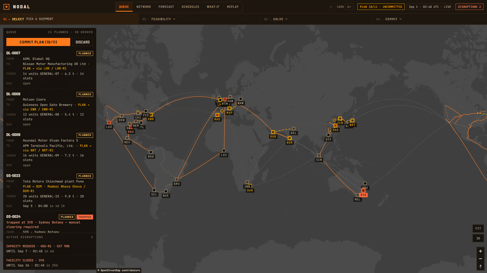
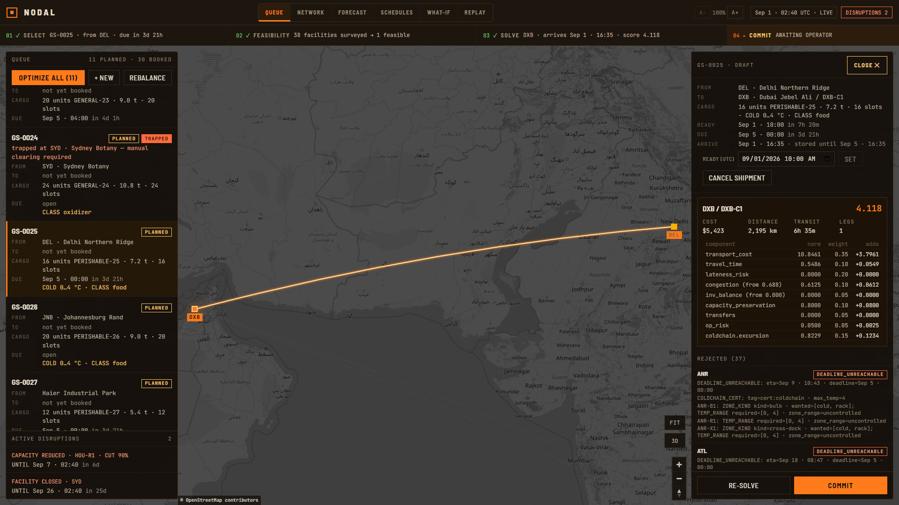
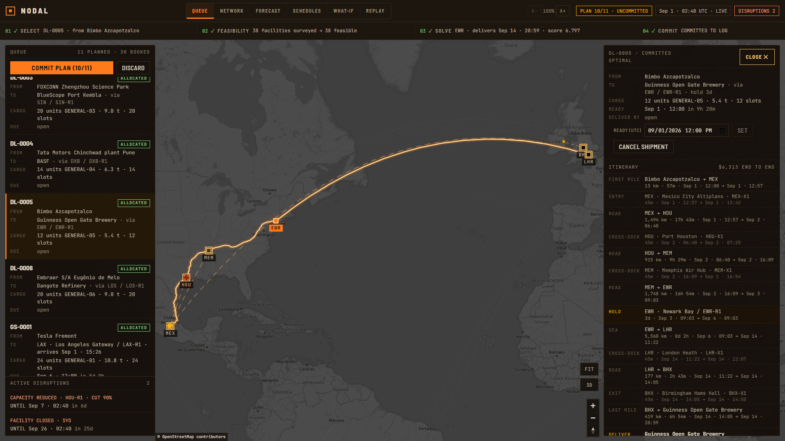

# Nodal

> **Public snapshot.** This repository is a published snapshot of a private development
> repository. The full commit history and ongoing work live privately; what you see here is
> the source as it stood when the snapshot was taken.

Nodal is an industrial logistics network optimizer. It models a distributed network —
facilities, the storage zones inside them, the inventory already held there, the road, sea
and air lanes between them, and a queue of shipments with cargo requirements and deadlines —
and decides where each shipment should go and how it should get there.

Decisions are made in two stages. Hard constraints first eliminate every destination that
cannot physically or legally take the goods, each elimination recorded with the constraint
responsible. The surviving candidates are then optimized against a configurable objective:
transport cost, travel time, lateness risk, facility congestion, inventory balance, future
capacity preservation, inter-facility transfers, and operational risk. When a facility closes
or a shipment slips, the engine re-plans the bookings that disruption actually touched rather
than reshuffling the network.

The domain is industry-neutral. The core understands capacity, certifications, temperature
bands and compatibility classes; industry-specific rules — cold chain, hazardous chemicals —
are separate rule packs layered on that shared vocabulary. Inventory tracking and the map
exist to give the optimizer the state it needs and to make its decisions inspectable.

## Features

- **Explainable allocation.** Every decision records which facilities were surveyed, which
  were rejected and by exactly which constraint, why the winner scored best, and how the
  booking affects future capacity.
- **Two decision shapes.** An *allocation* shipment has an origin and no destination — the
  optimizer chooses where it is received and stored. A *delivery* (A→B) also names a customer
  endpoint outside the network, and is routed origin → entry facility → through the lane
  network → exit facility → customer, including where it is held along the way.
- **Stop-aware routing.** One router plans every shipment. Each facility a journey touches is
  a stop with a dwell window, transit dwells book real staging capacity at cross-dock zones,
  and a closure rejects any overlapping stop with an explainable code.
- **Batch optimization.** Whole cohorts are solved jointly as a CP-SAT assignment model, with
  a min-cost-flow fast path where the problem structure permits it.
- **Re-optimization under disruption.** Facility closures, zone outages, capacity cuts,
  blocked lanes and delayed shipments trigger a tiered re-solve, with a churn penalty that
  keeps existing bookings unless moving them genuinely pays. Cargo already standing inside a
  closed facility is reported as trapped for manual clearing, never silently re-routed.
- **Inventory rebalancing.** Surplus stock is moved toward where it will be consumed, with
  every proposal that failed to justify its transport cost recorded rather than hidden.
- **What-if forks.** A hypothesis is applied to a fork of the event log and re-optimized on
  the same code path as a live disruption, then diffed against the baseline, which is never
  modified.
- **Event-sourced state and replay.** All state is folded from an append-only log, so
  historical reconstruction, audit chains and what-if forks are properties of the design
  rather than features bolted on top.
- **Simulator and benchmark harness.** Synthetic workloads, naive baseline policies, and a
  scenario × policy matrix that reports outcome KPIs deterministically.
- **Map interface.** A fullscreen real-geography map with the solve pipeline, decision
  explorer, facility and schedule panels, what-if, and a historical replay scrubber.

## Screenshots



*The network with a batch plan awaiting review — booked routes solid, proposed routes dashed,
standing disruptions and trapped cargo called out in the queue.*



*One decision, explained: the winner's score component by component, next to every rejected
facility with the constraint data that eliminated it.*



*An A→B delivery routed end to end — first mile, entry, lane legs, cross-dock stops, the hold,
the sea crossing, exit and last mile.*

## Architecture

Nodal is engine-first: the optimizer, the event-sourced model, the simulator and the
benchmark harness are the substance, the CLI drives all of it headless, and the web UI is a
client on top. The engine has no dependency on the server or the web app — CI proves this by
running the engine test suite with both directories deleted.

- **Engine** (`nodal/`) — domain model, constraint framework, feasibility filtering, scoring,
  the CP-SAT batch model and flow fast path, journey routing, re-optimization, what-if,
  simulation and benchmarking, behind a Typer CLI.
- **Event log** (`nodal/events/`) — an append-only SQLite event store with snapshotting.
  State is a fold over the log; nothing mutates it directly.
- **Rule packs** (`packs/`) — a generic core pack plus cold-chain and chemical packs, layered
  on a shared constraint vocabulary. The engine never imports a pack directly.
- **Server** (`server/`) — a FastAPI layer of read models and commands over the engine,
  guarded by a bearer token. An optional install extra.
- **Web** (`web/`) — a React and MapLibre GL single-page map interface, plus a browser smoke
  harness that drives and measures the real UI.

### Tech stack

Python 3.12+, Google OR-Tools (CP-SAT and min-cost flow), pydantic, Typer, SQLite,
FastAPI and uvicorn, React 18, TypeScript, Vite, MapLibre GL, Playwright.

### Project layout

```
nodal/         Engine
  domain/        Entities, capacity vectors, calendars, units
  events/        Event store, catalog, fold, state queries, replay
  network/       Lanes, travel model, stop-aware journey router
  rules/         Constraint framework, core rules, rejection messages
  allocate/      Feasibility, scoring, explanation, batch model, re-optimization, plan review
  sim/           Scenario specs, workload generator, baseline policies, simulation runner
  bench/         Benchmark harness, KPIs, report rendering
  cli/           Command-line interface
packs/         Industry rule packs: core, coldchain, chem
scenarios/     Benchmark scenario definitions and objective profiles
worlds/        Hand-authored worlds and the offline geodata snapshots the demo builds from
scripts/       Demo builder and performance measurement scripts
tests/         Engine test suite
server/        FastAPI read models and commands
web/           React map interface
  smoke/         Browser smoke harness
docs/          Design documentation
```

## Installation

Requires Python 3.12 or newer, and Node 20+ for the web interface.

```
python -m venv .venv
.venv\Scripts\activate            # Windows
source .venv/bin/activate         # macOS / Linux

pip install -e ".[dev,server]"
nodal --help
```

The `dev` extra adds the test and lint tooling; `server` adds the API layer. The engine alone
needs neither — `pip install -e .` is enough to use the CLI.

## Quickstart

### Command line

```
nodal world load worlds/demo.yaml --db var/demo.sqlite3
nodal state --db var/demo.sqlite3
nodal allocate SHP-2214 --db var/demo.sqlite3 --explain
```

The last command prints the full decision: the chosen facility and zone, the route and its
cost, every objective component with its raw value, normalization and weight, each alternative
scored the same way, and each rejected candidate with the constraint that eliminated it.

Other commands: `nodal optimize` (batch-solve the queue), `nodal whatif` (fork a hypothesis),
`nodal simulate` and `nodal bench` (run scenarios and the policy matrix), `nodal plan`
(inspect drafted batch plans), and `nodal state --at` (reconstruct a past instant).

### Web interface

Build the demo world, start the API, then start the dev server:

```
python scripts/make_global_demo.py

python -m server --db var/global-demo.sqlite3 \
    --profile scenarios/profiles/showcase.yaml --packs core,coldchain,chem

cd web && npm install && npm run dev
```

The interface is served at `http://localhost:5173`. The demo world builds entirely offline
from geodata snapshots committed in `worlds/showcase_snapshots.json`, so no map provider or
API key is needed to run it.

`--profile` and `--packs` are not optional here. The demo world is solved under that objective
profile and ships with an uncommitted plan on screen, so a server running any other objective
re-solves that plan differently and refuses to book it; the packs matter for the same reason,
since the world is seeded with cold-chain and hazmat goods.

Once connected, the demo walks through the whole loop: commit the pending plan, select a
shipment to focus the map on its own nodes and read its decision, solve a queued shipment,
close a facility and watch the re-optimization move bookings, fork a what-if hypothesis, and
scrub the replay back to before any of it happened. A smaller single-region world lives at
`worlds/demo.yaml`.

## Configuration

**API token.** The server generates and prints a bearer token at startup; paste it into the
interface's connect screen. Pass your own with `--token`, supply it in `NODAL_API_TOKEN`, or
disable auth entirely with `--no-auth` for local use.

**Map tiles.** The web interface draws OpenStreetMap's public raster tiles directly. That is
fine for running the demo locally, and is not acceptable as a hosted default — OSM's tile
service is a community resource, not a CDN for third-party deployments. Any real deployment
must point the tile source in `web/src/components/MapView.tsx` at its own provider and key.

**Maps provider (optional).** Geocoding, place search and real road geometry come from a maps
provider and are used for presentation and input only — engine decisions never depend on them
and stay offline-deterministic. Without a key the module degrades to flagged estimates rather
than failing. To enable it, put your key in `server/.env.maps`, which is gitignored:

```
NODAL_GOOGLE_MAPS_KEY=your-key-here
```

## Tests

```
ruff check .
ruff format --check .
mypy
mypy server
pytest
pytest -m bench
pytest server/tests
cd web && npm run build
```

CI runs all of these, and additionally runs the engine suite a second time with `server/` and
`web/` removed, to prove the engine depends on neither.

### Browser smoke harness

A type check proves nothing about what renders, so `web/smoke` drives the real interface in
headless Chromium and measures it — marker placement against the map projection, rendered
lanes and routes, panels that paint outside themselves or clip their own text, machine text
reaching the screen, overlapping or covered controls, hit-target sizes and badge contrast —
while walking every operator flow end to end.

```
cd web && npx playwright install chromium     # one-time

python scripts/make_global_demo.py            # each run needs a fresh demo database
python -m server --db var/global-demo.sqlite3 \
    --profile scenarios/profiles/showcase.yaml --packs core,coldchain,chem --token <token>
cd web && npm run dev

NODAL_API_TOKEN=<token> npm run smoke                          # 1920x1080
NODAL_API_TOKEN=<token> npm run smoke -- out-4k 2560 1400 1.5  # 2560x1400 at 150%
```

Screenshots are written per step, and the run exits non-zero on any failed check, page error
or unexpected failed request. See `web/smoke/README.md` for what each rule catches.

## Documentation

Design documentation and the measured evidence live in [`docs/`](docs/):

| Document | Contents |
| --- | --- |
| [docs/00-vision.md](docs/00-vision.md) | What Nodal is and is not — the project's framing |
| [docs/01-architecture.md](docs/01-architecture.md) | Domain and event model, allocation engine, batch model, stack decisions |
| [docs/02-roadmap.md](docs/02-roadmap.md) | The staged implementation plan with acceptance criteria |
| [docs/design_handoff_nodal_allocate/](docs/design_handoff_nodal_allocate/) | The visual-language brief the interface was built from |

## License

MIT — see [LICENSE](LICENSE).
